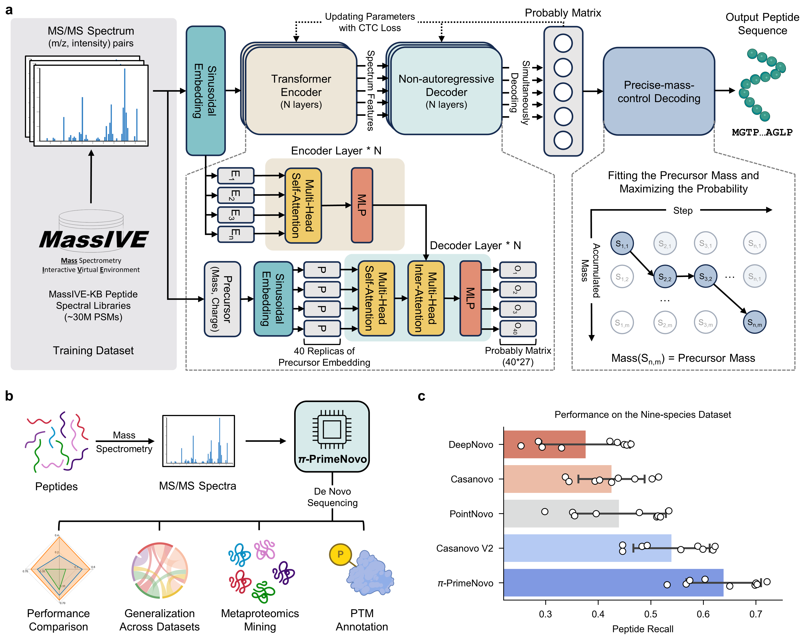

# $\pi$-PrimeNovo

This is the official repo for the paper: **[π-PrimeNovo: An Accurate and Efficient Non-Autoregressive Deep Learning Model for De Novo Peptide Sequencing](https://www.nature.com/articles/s41467-024-55021-3)**

We will release the future model update (user-interface, new model weight, optimized modules etc) here, please leave a **star** and **watching** if you want to get notified and follow up.


## Update：

**Mar. 2025**: We have released PrimeNovo-PTM code, including the weight for our finetuned PTM weight for Phosphorylation (+79.97) using LUAD-2020 dataset, which is exactly as detailed in our paper. It's currently under directory [pi-PrimeNovo-PTM](./pi-PrimeNovo-PTM), one can modify this code into any desired PTM he wants as per our instructions in `README.md` in this directory. 

**Jan. 2025**: We will be releasing PrimeNovo-PTM weight in near future, stay tuned. 

**Jan. 2025**: For those interested in gaining a deeper understanding of PMC algorithm designs, please refer to this paper : [A Character-Level Length-Control Algorithm for Non-Autoregressive Sentence Summarization](https://proceedings.neurips.cc/paper_files/paper/2022/hash/bb0f9af6a4881ccb6e14c11b8b4be710-Abstract-Conference.html).

While the algorithms are highly similar, yet still different if you read it carefully, this paper applies them in the context of NLP rather than De Novo Sequencing. It offers valuable insights from both an application perspective and an algorithm expression perspective, helping readers understand the design from multiple angles.

## Notes from Authors 

1. We developed our algorithm in CentOS Linux Version 7. For other OS systems, users need to check compability themselves.

2.  The MacOS users (with non-intel core) currently can not use this model due to un-supported CUDA drive.

3.  Machines that don't have Nvidia-GPUs can not use our algorithms as PMC is written directly with CUDA core, which is only supported by Nvidia-GPUs.

4.  We use lmdb for fast MS data reading during trianing and inference time. Once you provide your mgf and execute PrimeNovo, an lmdb file will be automatically generated for you. You can save this lmdb file and use it directly next time during training/inference, and no processing time will needed second time you load it. This is very good for large MS file processing and saves hours to days spent on pre-processing data and loading data to memory each time you train/inference a neural network model. For detailed implementation refer to dataloader and dataset file in our code base. 

5. We notice that CuPy Sometimes gives random errors, which can be resolved simply by re-running code or switching a GPU node.
   
## Environment Setup


Create a new conda environment first:

```
conda create --name PrimeNovo python=3.10
```

This will create an anaconda environment

Activate this environment by running:

```
conda activate PrimeNovo
```

then install dependencies:

```
pip install -r ./requirements.txt
```

installing gcc and g++:

```bash
conda install -c conda-forge gcc
conda install -c conda-forge cxx-compiler
```

then install ctcdecode, which is the package for ctc-beamsearch decoding

```bash
git clone --recursive https://github.com/WayenVan/ctcdecode.git
cd ctcdecode
pip install .
cd ..  #this is needed as ctcdecode can not be imported under the current directory
rm -rf ctcdecode
```

(if there are no errors, ignore the next line and proceed to CuPy install)

if you encountered issues with C++ (gxx and gcc) version errors in this step, install gcc with version specified as :  

```bash
conda install -c conda-forge gcc_linux-64=9.3.0
```

lastly, install CuPy to use our CUDA-accelerated precise mass-control decoding:

**_Please install the following Cupy package in a GPU available env, If you are using a slurm server, this means you have to enter a interative session with sbatch to install Cupy, If you are using a machine with GPU already on it (checking by nvidia-smi), then there's no problem_**

**Check your CUDA version using command nvidia-smi, the CUDA version will be on the top-right corner**

| cuda version | command |
|-------|-------|
|v10.2 (x86_64 / aarch64)| pip install cupy-cuda102 |
|v11.0 (x86_64)| pip install cupy-cuda110 |
|v11.1 (x86_64)| pip install cupy-cuda111 |
|v11.2 ~ 11.8 (x86_64 / aarch64)| pip install cupy-cuda11x |
|v12.x (x86_64 / aarch64)| pip install cupy-cuda12x |

## Model Settings

Some of the important settings in config.yaml under ./PrimeNovo 

**n_beam**: number of CTC-paths (beams) considered during inference. We recommend a value of 40.

**mass_control_tol**: This setting is only useful when **PMC_enable** is ```True```. The tolerance of PMC-decoded mass from the measured mass by MS, when mass control algorithm (PMC) is used. For example, if this is set to 0.1, we will only obtain peptides that fall under the mass range [measured_mass-0.1, measured_mass+0.1]. ```Measured mass``` is calculated by : (pepMass - 1.007276) * charge - 18.01. pepMass and charge are given by input spectrum file (MGF).

**PMC_enable**: Weather use PMC decoding unit or not, either ```True``` or ```False```.

**n_peaks**: Number of the most intense peaks to retain, any remaining peaks are discarded. We recommend a value of 800.

**min_mz**: Minimum peak m/z allowed, peaks with smaller m/z are discarded. We recommend a value of 1.

**max_mz**: Maximum peak m/z allowed, peaks with larger m/z are discarded. We recommend a value of 6500.

**min_intensity**: Min peak intensity allowed, less intense peaks are discarded. We recommend a value of 0.0.

## Run Instructions

**Note!!!!!!!!!!!!!!!!!!:** All the following steps should be performed under the main directory: `pi-PrimeNovo`. Do **not** use `cd PrimeNovo` !!!!!!!!!!!!!!!!!!!

### Step 1: Download Required Files

To evaluate the provided test MGF file (you can replace this MGF file with your own), download the following files:

1. **Model Checkpoint**: [model_massive.ckpt](https://drive.google.com/file/d/12IZgeGP3ae3KksI5_82yuSTbk_M9sKNY/view?usp=share_link)
2. **Test MGF File**: [Bacillus.10k.mgf](https://drive.google.com/file/d/1HqfCETZLV9ZB-byU0pqNNRXbaPbTAceT/view?usp=drive_link)

**Note:** If you are using a remote server, you can use the `gdown` package to easily download the content from Google Drive to your server disk.

### Step 2: Choose the Mode

The `--mode` argument can be set to either:

- `eval`: Use this mode when evaluating data with a labeled dataset.
- `denovo`: Use this mode for de novo analysis on unlabeled data.

**Important**: Select `eval` only if your data is labeled.

### Step 3: Run the Commands

Execute the following command in the terminal:

```bash
python -m PrimeNovo.PrimeNovo --mode=eval --peak_path=./bacillus.10k.mgf --model=./model_massive.ckpt
```

This automatically uses all GPUs available in the current machine.

### Step 4: analyze the output

We include a sample running output ```./output.txt```. The performance for evaluation will be reported at the end of the output file.

If you are using ```denovo``` mode, you will get a ```denovo.tsv``` file under the current directory. The file has the following structure:

| label | prediction | charge | score |
| --- | --- | --- | --- |
| Title in MGF document | Sequence in [ProForma](https://doi.org/10.1021/acs.jproteome.1c00771) notation| Charge, as a number | Confidence score as number in range 0 and 1 using scientific notation |

The example below contains two peptides predicted based on some given spectrum:

```tsv
label	prediction	charge	score
MS_19321_2024_02_DDA	ATTALP	2	0.99
MS_19326_2024_02_DDA	TAM[+15.995]TR	2	0.87
```

## Citation

Bibtex：

```bibtex
@article{zhang2025pi,
  title={$\pi$-PrimeNovo: an accurate and efficient non-autoregressive deep learning model for de novo peptide sequencing},
  author={Zhang, Xiang and Ling, Tianze and Jin, Zhi and Xu, Sheng and Gao, Zhiqiang and Sun, Boyan and Qiu, Zijie and Wei, Jiaqi and Dong, Nanqing and Wang, Guangshuai and others},
  journal={Nature Communications},
  volume={16},
  number={1},
  pages={267},
  year={2025},
  publisher={Nature Publishing Group UK London}
}
```

Standard Citation:

```
Zhang, X., Ling, T., Jin, Z. et al. π-PrimeNovo: an accurate and efficient non-autoregressive deep learning model for de novo peptide sequencing. Nat Commun 16, 267 (2025). https://doi.org/10.1038/s41467-024-55021-3
```
